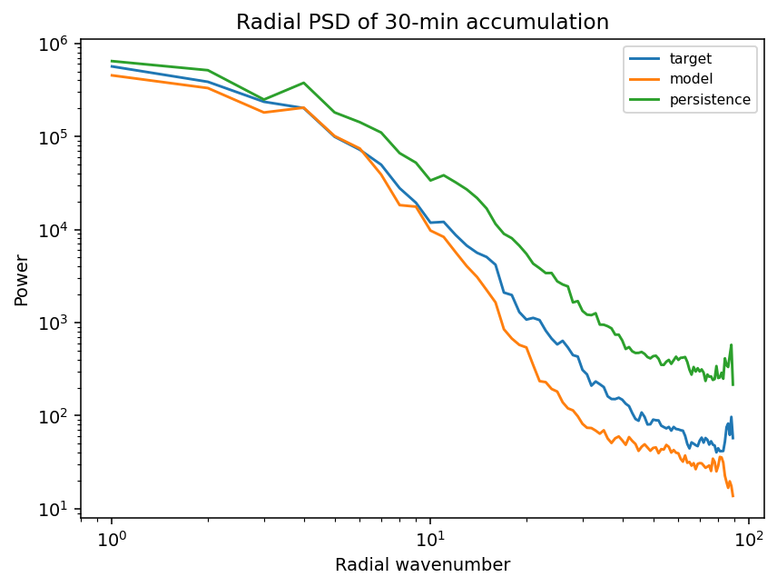

**Work In Progress**

> *Actively Migrating*:
>
> I'm currently developing the project codebase based on local prototypes/experiments. My initial goal is a standalone version in this repo as a solid foundation to subsequently build upon by iteratively pushing improvements. I'm in the process of refactoring to ensure good readability.

*Current Status*: The working baseline "core" is now fully compiled and verified atm. Next, I'm going to begin with the step-by-step integeration of all relevant local findings that expand on the presently available baseline.

---

**Baseline Model Performance**

---

### Acknowledgments

I implemented parts of this project with helpful assistance of capable AI models like Claude 4.6 and GPT-5.4. They mainly helped with general questions but were also employed within agent harnesses for code structuring and a significant initial baseline refactor based on my local prototype versions. The scientific methodology, (model) architecture decisions, and experimental evaluation are my own work and reflect my learning process in this domain. The present implementation state builds on an iterative development process across multiple prototypes.