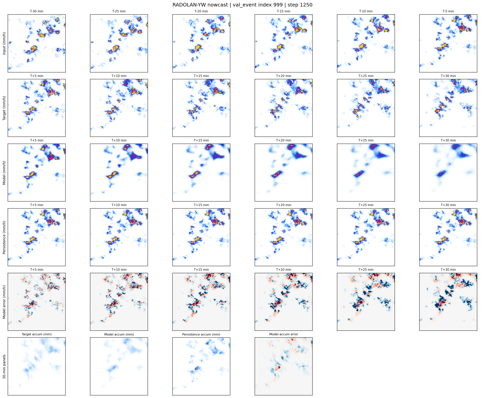

**Work in progress: Baseline available**

> **Actively migrating from local projects in progress**
> Baseline implementation is available but currently still compiling the project codebase based on multiple local prototypes. Goal is a single standalone version in this repo. I'm in the process of refactoring to ensure good readability.

*Current Status:* Only baseline core is fully migrated and verified atm. I'm going to itnegrate all local findings incrementally.

---

